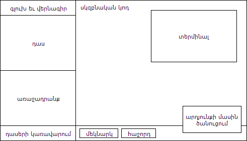

# Բովանդակություն  
 - [Նախաբան](#Նկարագրություն)
 - [Դասընթացների պատրաստում](#Դասընթացների-պատրաստում)
 - [Հրամաններ](./commands)

# Նախաբան
*LinguaCode*-ը նախատեսված է բոլոր նրանց համար ովքեր ուզում են արագ յուրացնել ծրագրավորման բազային գիտելիքները։ *LinguCode*-ի միջոցով ծրագրավորում սովորելու համար պարտադիր չէ տիրապետել լեզուների կամ ունենալ տեխնիկական գիտելիքներ, բավական է միայն ունենալ սովորելու ցանկություն եւ աշխատասիրություն :)

# Հնարավորությունները
 - **Բազմալեզու**  
Ծրագրային կոդը կարող է գրվել ձեր մայրենի լեզվով։ Պարտադիր չէ անգլերենի կամ ռուսերենի իմացություն գրելու կամ հասկանալու ծրագրային կոդը, որը հնարավորություն է տալիս առանց դժվարության հասկանալ եւ հիշել հրամանների նշանակությունը։

 - **Հասանելիություն**  
Գրված ծրագրային կոդը կարող է հասանելի լինել ցանկացած լեզվով։ Դուք կարող եք ինչպես կարդալ եւ հասկանալ արտասահմանյան լեզվով գրված ծրագիրն, այնպես էլ արտասահմանյա երկրի բնակիչը կարող է հասկանալ ձեր գրած ծրագիրը։ Սա հնարավորություն կտա թիմում աշխատել ինչպես տեղացի ընկերների, այնպես էլ արտասահմանյան բնակչի հետ։

 - **Պարզություն**  
Լեզուն առավել պարզ է քան ցանկացած այլ ծրագրավորման լեզվում է։ լեզվի գրելաոճը (այսուհետ՝ *սինտակսիսը*) ստեղծվել է Python, Pascal, JavaScript լեզուների հիման վրա՝ հիմքը դնելով պարզության եւ հետագայում այլ լեզուների արագ անցման վրա․
	- հրամանները կարող են գրվել ինչպես մեծատառ, այնպես էլ փոքրատառ,
	- խմբագրման միջավայրը համալրված է մի շարք հնարավորություններով, ինչն օգնում է առավել արագ հասկանալ ծրագիրը,

 - **Բազմապլատֆորմ**  
 Կլինի ձեր սարքավորումը սեղանային համակարգիչ, նոութբուք, բջջային հեռախոս, կամ ուղղակի էլեկտրոնային գիրք, որն ունի ինտերնետ կապ, դուք կկարողանաք օգտվել LinguaCode-ից։
 
 - **Անվճար :)**  
 Նախագծի նպատակն է բոլոր նրանց, ովքեր ցանկություն ունեն սովորելու ծրագրավորում, տալ այդ հնարավորությունն՝ անվճար։

# Դասընթացների պատրաստում
## Նկարագրություն
Սա ձեռնարկ է, թե ինչպես ստեղծել դաս-օրինակ-առաջադրանք-ստուգում ձեւաչափի դաս։

## դասընթացի վերջնական տեքսը։


## կառուցվածքը՝
```
chapter-name  
├─ tutorials  
│  └─ tutorial-0.json  
│  └─ tutorial-1.json  
│  └─ tutorial-2.json  
│  └─ tutorial-N.json  
└─ chapter.json
```
## chapter.json՝
```json
{
  "author": {
    "name": "Arman Yeghiazaryan",
    "email": "arman@linguacode.me",
    "url": "http://otanim.com",
  },
  "language": "hy",
  "chapter": {
    "title": "Արտածում",
    "description": "Դասընթացը բացատրում է, թե ինչպես արտածել տերմինալում տեքստ։",
  },
  "sources": "դասի պատրաստման համար օգտագործված աղբյուրն է introtopython.org/syllabus.html կայքը։",
  "notes": "դասը ենթակա է ստուգման",
}
```

<ul>
	<li><b>author</b><br />
	Դասի Հեղինակի&nbsp;տվյալներն է։<br />
	Տիպը՝&nbsp;<em>օբյեկտ</em>։
	<ul>
		<li><b>name</b><br />
		Հեղինակի անունը եւ ազգանունը։<br />
		Տիպը՝&nbsp;<em>տող</em>։</li>
		<li><b>email</b><br />
		Հեղինակի էլ․ հասցեն:<br />
		Տիպը՝&nbsp;<em>տող</em>։</li>
		<li><b>url</b><br />
		Հեղինակի անձանական կամ սոց․ էջի հասցեն։<br />
		Տիպը՝&nbsp;<em>տող</em>։</li>
	</ul>
	</li>
	<li>
	<div><b>language</b><br />
	Թեմայում առկա դաընթացների լեզուն՝&nbsp;<a href="https://en.wikipedia.org/wiki/ISO_639-1">ISO 639-1</a>&nbsp;ստանդարտով։<br />
	Տիպը՝&nbsp;<em>տող</em>։<br />
	<em>(պարտադիր է լրացման)</em></div>
	</li>
	<li><strong>chapter</strong><br />
	Թեման։<br />
	Տիպը՝&nbsp;<em>օբյեկտ</em>։<br />
	<em>(պարտադիր է լրացման)</em>
	<ul>
		<li><strong>title</strong><br />
		Դասի վերնագիրը։<br />
		Տիպը՝&nbsp;<em>տող</em>։<br />
		<em>(պարտադիր է լրացման)</em></li>
		<li><strong>description</strong><br />
		Թեմայի նկարագրությունը։<br />
		Տիպը՝&nbsp;<em>տող</em>։<br />
		<em>(պարտադիր է լրացման)</em></li>
	</ul>
	</li>
	<li><strong>sources</strong><br />
	Դասի պատրաստման համար օգտագործված նյութերի հղումները։<br />
	Տիպը՝&nbsp;<em>տող</em>։</li>
	<li><strong>notes</strong><br />
	Նշումներ դասի վերաբերյալ։<br />
	Տիպը՝&nbsp;<em>տող</em>։</li>
</ul>

## tutorial-N.json՝
```json
{
  "author": {
    "name": "Arman Yeghiazaryan",
    "email": "arman@linguacode.me",
    "url": "http://otanim.com",
  },
  "tutorial": {
    "article": {
      "title": "նախաբան",
      "lesson": "Տերմինալում տեքստի արտածման համար օգտագործվում է **տպել** հրամանը: Օրինակ՝  \n**մուտք**՝  \n`տպել «ողջույն»`  \n**ելք**՝  \n`«ողջույն»`",
      "task": "1. Մեկնարկեք ծրագիրը, եւ տեսեք արդյունքը։  \n2. Փոփոխեք առկա արտածման տեքստը ձեր անունով, եւ մեկնարկեք ծրագիրը։",
    },
    "code": {
      "source": "տպել «ողջո՛ւյն»",
      "source": "տպել «ողջո՛ւյն»",
      "markers": {
        "color": "red",
        "range": [0, 6, 0, 13]
      },
      "readOnly": [
        [0, 0, 0, 5],
        [0, 14, 0, 999]
      ],
      "cursor": [0, 6],
    },
    "validations": {
      "source": {
        "regExp": "/^տպել «.*»\\s*$/ig",
        "error": "հայտնաբերված է սխալ"
      },
      "output": {
        "regExp": "/.*/ig",
        "error": "հայտնաբերված է սխալ"
      },
    }
  },
  "sources": "դասի պատրաստման համար օգտագործված աղբյուրն է introtopython.org/syllabus.html կայքը։",
  "notes": "դասը ենթակա է ստուգման",
}
```

<ul>
	<li><b>author </b><br />
	Դասի Հեղինակի&nbsp;տվյալներն է։<br />
	Տիպը՝&nbsp; <em> օբյեկտ </em> ։
	<ul>
		<li><b>name </b><br />
		Հեղինակի անունը եւ ազգանունը։<br />
		Տիպը՝&nbsp; <em> տող </em> ։</li>
		<li><b>email </b><br />
		Հեղինակի էլ․ հասցեն:<br />
		Տիպը՝&nbsp; <em> տող </em> ։</li>
		<li><b>url </b><br />
		Հեղինակի անձանական կամ սոց․ էջի հասցեն։<br />
		Տիպը՝&nbsp; <em> տող </em> ։</li>
	</ul>
	</li>
	<li><strong>tutorial </strong><br />
	Դասի&nbsp;պարամետրերը։<br />
	Տիպը՝&nbsp; <em> օբյեկտ </em> ։<br />
	<em>(պարտադիր է լրացման) </em>
	<ul>
		<li><strong>article </strong><br />
		Դասը։<br />
		Տիպը՝&nbsp; <em> օբյեկտ </em> ։<br />
		<em>(պարտադիր է լրացման) </em>
		<ul>
			<li><strong>title </strong><br />
			Դասի վերնագիրը։<br />
			Տիպը՝&nbsp; <em> տող </em> ։<br />
			<em>(պարտադիր է լրացման) </em></li>
			<li><strong>lesson </strong><br />
			Դասի նկարագրությունը։ <strong> <a href="http://guides.github.com/features/mastering-markdown" target="_blank"> markdown </a> </strong> -ի կիրառումը թույլատրված է։<br />
			Տիպը՝&nbsp; <em> տող </em> ։<br />
			<em>(պարտադիր է լրացման) </em></li>
			<li><strong>task </strong><br />
			Դասի առաջադրանքը։ <strong> <a href="http://guides.github.com/features/mastering-markdown" target="_blank"> markdown </a> </strong> -ի կիրառումը թույլատրված է։<br />
			Տիպը՝&nbsp; <em> տող </em> ։<br />
			<em>(պարտադիր է լրացման) </em></li>
		</ul>
		</li>
		<li><strong>code </strong><br />
		Ծրագրային կոդի պարամետրերը։<br />
		Տիպը՝&nbsp; <em> օբյեկտ </em> ։<br />
		<em>(պարտադիր է լրացման) </em>
		<ul>
			<li><strong>source </strong><br />
			Սկզբնական կոդը։<br />
			Տիպը՝ &nbsp;<i>տող</i>։<br />
			<em>(պարտադիր է լրացման)</em></li>
			<li><strong>continuus</strong><br />
			Եթե արժեքը true է, ապա առաջադրանքը համարվում է շարունակական եւ սկզբնական կոդը մնում է նույնն ինչով, որ ավարտվել էր նախորդը առաջադրանքը։<br />
			Եթե ներկայիս առաջադրանքն առաջինն է <em>թեմայում</em>, ապա նշված արժեքն անտեսվում է եւ փոխարինվում false-ով։<br />
			Լռելյայն արժեքը՝ <em>false</em>:<br />
			Տիպը՝&nbsp; <em> տրամաբանական</em>։</li>
			<li><strong>markers </strong><br />
			Կոդի ընդգծման պարամետրերը։ Կարող է լինել ինչպես մի պարամետր, այնպես էլ պարամետրերի խումբ՝ զանգվածի տեսքով։<br />
			<em>color </em> ենթապարամետրի բացառության դեպքում կարող է պարունակել միայն <em> range </em> -ի արժեքը։<br />
			Տիպը՝&nbsp; <em> օբյեկտ </em> կամ <em> զանգված՝ </em> կազմված <em> օբյեկտներից </em> ։
			<ul>
				<li><strong>color </strong><br />
				Ընդգծման գույնը։<br />
				Լռելյայն, եթե այս տողը նշված չէ, արժեքը կլինի &quot;<em>red</em>&quot;։<br />
				Հնարավոր արժեքները՝ <em> &quot;red&quot; </em> , <em> &quot;orange&quot; </em> , <em> &quot;yellow&quot; </em> , <em> &quot;green&quot; </em> , <em> &quot;blue&quot; </em> , <em> &quot;violet&quot; </em> , <em> &quot;purple&quot; </em> , <em> &quot;pink&quot; </em> :<br />
				Տիպը՝&nbsp; <em> տող </em> ։</li>
				<li><strong>range </strong><br />
				Ընդգծման կոորդինատները։<br />
				Արժեքը՝ <em> [տող1, սյուն1, տող2, սյուն2] </em> :<br />
				Տիպը՝&nbsp; <em> զանգված՝ </em> կազմված <em> թվերից </em> ։</li>
			</ul>
			</li>
			<li><strong>readOnly </strong><br />
			Կոդի խմբագրման արգելափակման կոորդինատները։&nbsp;Կարող է լինել ինչպես մի պարամետր, այնպես էլ պարամետրերի խումբ՝ զանգվածի տեսքով։<br />
			Արժեքը՝&nbsp; <em> [տող1, սյուն1, տող2, սյուն2] </em> :<br />
			Տիպը՝&nbsp; <em> զանգված՝ </em> կազմված <em> թվերից </em> ։</li>
			<li><strong>cursor </strong><br />
			Նշորդի դիրքը սկզբնական կոդում։<br />
			Արժեքը՝&nbsp; <em> [տող1, սյուն1] </em> :<br />
			Տիպը՝&nbsp; <em> զանգված՝ </em> կազմված <em> թվերից </em> ։</li>
		</ul>
		</li>
		<li><strong>validations </strong><br />
		Առաջադրանքի ստուգում։<br />
		Տիպը՝&nbsp; <em> օբյեկտ </em> ։
		<ul>
			<li><b>source </b><br />
			Օգտատիրոջ կողմից&nbsp;փոփոխված ծրագրային կոդի ստուգման regular expression:<br />
			Տիպը՝&nbsp; <em> տող </em> ։
			<ul>
				<li>
				<div>​ <b> regExp </b><br />
				Օգտատիրոջ կողմից&nbsp;փոփոխված ծրագրային կոդի ստուգման regular expression:<br />
				Տիպը՝&nbsp; <em> տող </em> ։</div>
				</li>
				<li>
				<div>
				<div>​ <strong> message </strong><br />
				Համապատասխան սխալի մասին արտածվելիք տեքստը։<br />
				Լռելյան, եթե այս տողը նշված չէ, սխալ արտածման տեքստն է․ <em> &laquo;ծրագրում առկա է սխալ&raquo; </em> ։</div>

				<div>Տիպը՝&nbsp; <em> տող </em> ։</div>
				</div>
				</li>
			</ul>
			</li>
			<li><strong>output </strong><br />
			Օգտատիրոջ կողմից&nbsp;փոփոխված ծրագրային կոդի ելքի&nbsp;ստուգման regular expression:<br />
			Տիպը՝&nbsp; <em> տող </em> ։
			<ul>
				<li>​ <b> regExp </b>
				<div>Օգտատիրոջ կողմից&nbsp;փոփոխված ծրագրային կոդի ստուգման regular expression:<br />
				Տիպը՝&nbsp; <em> տող </em> ։</div>
				</li>
				<li>
				<div>​ <strong> message </strong><br />
				Համապատասխան սխալի մասին արտածվելիք տեքստը։<br />
				Լռելյան, եթե այս տողը նշված չէ, սխալ արտածման տեքստն է․&nbsp; <em> &laquo;ծրագրում առկա է սխալ&raquo; </em> ։</div>

				<div>
				<div>Տիպը՝&nbsp; <em> տող </em> ։</div>
				</div>
				</li>
			</ul>
			</li>
		</ul>
		</li>
	</ul>
	</li>
	<li><strong>sources </strong><br />
	Դասի պատրաստման համար օգտագործված նյութերի հղումները։<br />
	Տիպը՝&nbsp; <em> տող </em> ։</li>
	<li><strong>notes </strong><br />
	Նշումներ դասի վերաբերյալ։<br />
	Տիպը՝&nbsp; <em> տող </em> ։</li>
</ul>
