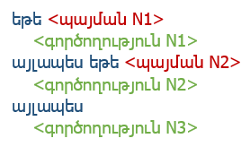
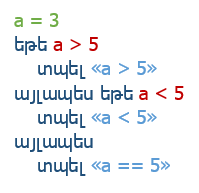

#### Բովանդակություն  
 - [Նկարագրություն](#arrow_double_up-Նկարագրություն)
  - [Առավելությունները](#arrow_double_up-Առավելությունները)
  - [Թերությունները](#arrow_double_up-Թերությունները)
 - [Հրամաններ](#arrow_double_up-Հրամաններ)

## [:arrow_double_up:](#Բովանդակություն) Նկարագրություն
*LinguaCode*-ը նախատեսված է բոլոր նրանց համար ովքեր ուզում են արագ յուրացնել ծրագրավորման բազային գիտելիքները։ *LinguCode*-ի միջոցով ծրագրավորում սովորելու համար պարտադիր չէ տիրապետել լեզուների կամ ունենալ տեխնիկական գիտելիքներ, բավական է միայն ունենալ սովորելու ցանկություն եւ աշխատասիրություն :)

#### [:arrow_double_up:](#Բովանդակություն) Առավելությունները
 - **Բազմալեզու**  
Ծրագրային կոդը կարող է գրվել ձեր մայրենի լեզվով։ Պարտադիր չէ անգլերենի կամ ռուսերենի իմացություն գրելու կամ հասկանալու ծրագրային կոդը, որը հնարավորություն է տալիս առանց դժվարության հասկանալ եւ հիշել հրամանների նշանակությունը։

 - **Հասանելիություն**  
Գրված ծրագրային կոդը կարող է հասանելի լինել ցանկացած լեզվով։ Դուք կարող եք ինչպես կարդալ եւ հասկանալ արտասահմանյան լեզվով գրված ծրագիրն, այնպես էլ արտասահմանյա երկրի բնակիչը կարող է հասկանալ ձեր գրած ծրագիրը։ Սա հնարավորություն կտա թիմում աշխատել ինչպես տեղացի ընկերների, այնպես էլ արտասահմանյան բնակչի հետ։

 - **Պարզություն**  
Լեզուն առավել պարզ է քան ցանկացած այլ ծրագրավորման լեզվում է։ լեզվի գրելաոճը (այսուհետ՝ *սինտակսիսը*) ստեղծվել է Python, Pascal, JavaScript լեզուների հիման վրա՝ հիմքը դնելով պարզության եւ հետագայում այլ լեզուների արագ անցման վրա․
	- հրամանները կարող են գրվել ինչպես մեծատառ, այնպես էլ փոքրատառ,
	- խմբագրման միջավայրը համալրված է մի շարք հնարավորություններով, ինչն օգնում է առավել արագ հասկանալ ծրագիրը,

 - **Բազմապլատֆորմ**  
 Կլինի ձեր սարքավորումը սեղանային համակարգիչ, նոութբուք, բջջային հեռախոս, կամ ուղղակի էլեկտրոնային գիրք, որն ունի ինտերնետ կապ, դուք կկարողանաք օգտվել LinguaCode-ից։
 
 - **Անվճար :)**  
 Նախագծի նպատակն է բոլոր նրանց, ովքեր ցանկություն ունեն սովորելու ծրագրավորում, տալ այդ հնարավորությունն՝ անվճար։
 
#### [:arrow_double_up:](#Բովանդակություն) Թերությունները
 - **Այժ հնարավոր է օգտվել միայն առցանց։**  
 Ինտերնետ կապի բացակայության դեպքում, նախագիծն անհասանելի կլինի։
 - **Հնարավոր չէ սովորել խորացված ծրագրավորում։**  
 Նախագծի բուն նպատակն է օգնելու սկսել ծրագրավորում եւ արագ անցում կատարել այլ լեզուների։

## [:arrow_double_up:](#Բովանդակություն) Հրամաններ 
#### **Արտածում**

| Հրաման | Նկարագրություն |
|:-------------------------------|:----------------------------------------------------------------------------|
|                                                                               | հրամանն արտածում է *Terminal*-ում նրան հաջորդիվ չակերտներում գրված տեքստը։                                                          |

##### **Օրինակ՝**

| մուտք | ելք |
|:-------------------|:-----------|
|  | `Ողջո՛ւյն` |

----------

#### **Ներմուծում**

| Հրաման          | Նկարագրություն |
|:-------------------------------|:----------------------------------------------------------------------------|
|  | հրամանը թույլ է տալիս օգտատիրոջը *Terminal*-ում ներմուծել փոփոխական։ |

##### **Օրինակ՝**

| մուտք | ելք |
|:-------------------|:-----------|
|  | `# այստեղ կարտածվի ցանկացած արժեք, ինչ մուտքագրվել է X-ում։` |
----------

#### **Պայմանային օպերատոր**

| Հրաման | Նկարագրություն |
|:-------------------------------|:----------------------------------------------------------------------------|
|                                                                              | Պայմանական այս հրամանը ստուգում է, եթե 1-ին պայման -ճիշտ է, ապա կատարում է 1-ին գործողությունը, այլապես եթե ճշմարտացի է 2-րդ պայմանը՝ 2-րդ գործողությունը, այլապես 3-րդ գործողությունը։                                                                             |

##### **Օրինակ՝**

| մուտք | ելք |
|:-------------------|:-----------|
| | `a < 5` |
