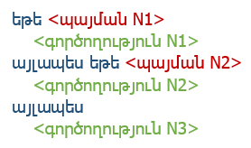
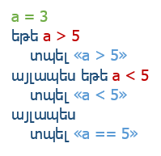

# [:arrow_upper_left:](../../../) Հրամաններ 
### **Արտածում**

| Հրաման | Նկարագրություն |
|:-------------------------------|:----------------------------------------------------------------------------|
|                                                                               | հրամանն արտածում է *Terminal*-ում նշված փոփոխականը կամ արժեքը։                                                          |

#### **Օրինակ՝**

| մուտք | ելք |
|:-------------------|:-----------|
|  | `Ողջո՛ւյն` |

----------

### **Ներմուծում**

| Հրաման          | Նկարագրություն |
|:-------------------------------|:----------------------------------------------------------------------------|
|  | հրամանը թույլ է տալիս օգտատիրոջը *Terminal*-ում ներմուծել փոփոխական։ |

#### **Օրինակ՝**

| մուտք | ելք |
|:-------------------|:-----------|
|  | `# այստեղ կարտածվի ցանկացած արժեք, ինչ մուտքագրվել է X-ում։` |
----------

### **Պայմանային օպերատոր**

| Հրաման | Նկարագրություն |
|:-------------------------------|:----------------------------------------------------------------------------|
|                                                                              | Պայմանական այս հրամանը ստուգում է, եթե 1-ին պայմանը ճիշտ է, ապա կատարում է 1-ին գործողությունը, այլապես եթե ճշմարտացի է 2-րդ պայմանը՝ 2-րդ գործողությունը, այլապես 3-րդ գործողությունը։                                                                             |

#### **Օրինակ՝**

| մուտք | ելք |
|:-------------------|:-----------|
| | `a < 5` |
